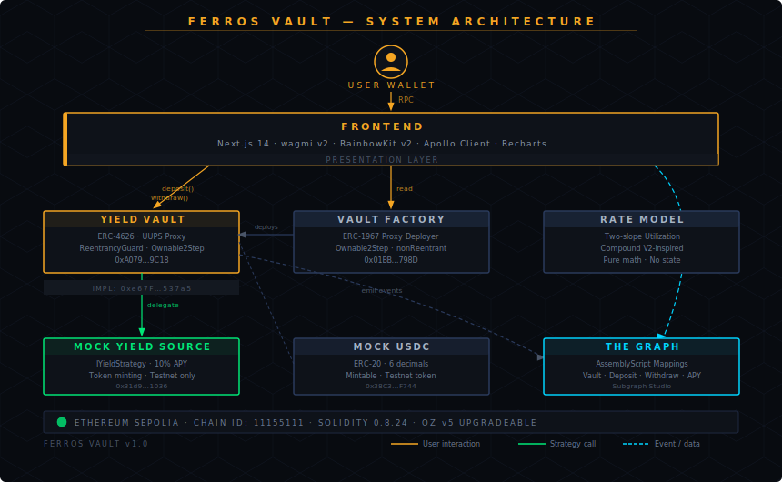

# Ferros Vault

> Production-grade ERC-4626 tokenized yield vault — upgradeable proxy architecture, pluggable yield strategies, on-chain indexing via The Graph, and a full-stack DeFi dashboard.

**Network:** Ethereum Sepolia (Chain ID: 11155111)

---

## Overview

Ferros Vault is a modular, permissionless yield vault protocol built on the ERC-4626 tokenized vault standard. Users deposit USDC and receive vault shares that appreciate as yield accrues through a pluggable `IYieldStrategy` interface. The vault is factory-deployed, UUPS upgradeable, and enforces strict security invariants including CEI ordering and reentrancy protection.

---

## System Architecture



---

## Repository Structure

```
ferros-vault/
├── contracts/
│   ├── src/
│   │   ├── YieldVault.sol              ERC-4626 core vault (UUPS proxy)
│   │   ├── VaultFactory.sol            ERC-1967 proxy factory
│   │   ├── InterestRateModel.sol       Two-slope Compound-style rate model
│   │   └── strategies/
│   │       └── MockYieldSource.sol     Testnet yield strategy (10% APY)
│   ├── test/
│   │   ├── YieldVault.t.sol            Unit tests (20+ functions)
│   │   ├── YieldVaultFuzz.t.sol        Fuzz invariant tests (10,000 runs)
│   │   ├── YieldVaultGas.t.sol         Gas benchmark suite
│   │   └── Integration.t.sol           Fork integration test
│   └── script/
│       └── Deploy.s.sol                Multi-chain deployment script
├── subgraph/
│   ├── schema.graphql                  Vault, Deposit, Withdraw, User entities
│   ├── src/
│   │   ├── factory.ts                  handleVaultCreated mapping
│   │   └── vault.ts                    handleDeposit/Withdraw/Harvest
│   └── queries/queries.graphql         Named query library
└── frontend/
    ├── src/app/
    │   ├── page.tsx                    Dashboard (TVL, APY, position)
    │   └── docs/page.tsx               Protocol documentation
    └── src/components/
        ├── Navbar.tsx                  Responsive nav with mobile drawer
        ├── StatCard.tsx                Metric display cards
        ├── DepositModal.tsx            Approve → deposit flow
        ├── WithdrawModal.tsx           Withdraw with max-fill
        └── VaultChart.tsx             Dual-axis Recharts TVL/APY chart
```

---

## Smart Contracts

| Contract | Address | Description |
|---|---|---|
| `YieldVault` | [`0xA079817DA19E6b3C741DB521F96Ce135A46d9C18`](https://sepolia.etherscan.io/address/0xA079817DA19E6b3C741DB521F96Ce135A46d9C18) | ERC-4626 vault (UUPS proxy) |
| `VaultFactory` | [`0x01BbE74E7e8bC7545Db661a97948889F488f798D`](https://sepolia.etherscan.io/address/0x01BbE74E7e8bC7545Db661a97948889F488f798D) | Deploys vault instances |
| `YieldVaultImpl` | [`0xe67FDE4F596639e021B4F1Da3Da43621285537a5`](https://sepolia.etherscan.io/address/0xe67FDE4F596639e021B4F1Da3Da43621285537a5) | Implementation contract |
| `MockYieldSource` | [`0x31d93658903E604416F1E8DD6280C0E191236036`](https://sepolia.etherscan.io/address/0x31d93658903E604416F1E8DD6280C0E191236036) | Testnet yield strategy |
| `MockERC20 (USDC)` | [`0x38C3096d7BFeb3F951CBCeE474aC31b61F2dF744`](https://sepolia.etherscan.io/address/0x38C3096d7BFeb3F951CBCeE474aC31b61F2dF744) | 6-decimal test token |

All contracts verified on Etherscan.

---

## Tech Stack

| Layer | Stack |
|---|---|
| Contracts | Foundry · Solidity 0.8.24 · OpenZeppelin v5 (upgradeable) |
| Testing | Forge unit + fuzz + gas tests · Slither v0.11.5 static analysis |
| Indexing | The Graph · AssemblyScript mappings · GraphQL |
| Frontend | Next.js 14 · TypeScript · Tailwind CSS · wagmi v2 · viem · RainbowKit v2 |
| Data | Apollo Client v3 · React Query · Recharts |
| Network | Ethereum Sepolia (11155111) |

---

## Getting Started

### Prerequisites

- Node.js v20+
- Foundry (`curl -L https://foundry.paradigm.xyz | bash && foundryup`)

### Contracts

```bash
cd contracts
forge install
forge build
forge test -vvv
forge coverage
```

### Deploy

```bash
cd contracts
cp .env.example .env
# Fill in PRIVATE_KEY, ARBITRUM_SEPOLIA_RPC, ETHERSCAN_API_KEY

forge script script/Deploy.s.sol:Deploy \
  --rpc-url $SEPOLIA_RPC \
  --broadcast \
  --verify
```

Deployment addresses written to `deployments/{chainId}.json`.

### Frontend

```bash
cd frontend
cp .env.example .env
# Fill in NEXT_PUBLIC_WALLETCONNECT_PROJECT_ID, NEXT_PUBLIC_VAULT_ADDRESS

npm install
npm run dev
# → http://localhost:3000
```

### Subgraph

```bash
cd subgraph
npm install
graph codegen && graph build
graph deploy --studio ferros-vault
```

---

## Key Interfaces

```solidity
// Deposit USDC, receive vault shares
function deposit(uint256 assets, address receiver) external returns (uint256 shares);

// Withdraw USDC, burn vault shares
function withdraw(uint256 assets, address receiver, address owner) external returns (uint256 shares);

// Preview share price
function convertToAssets(uint256 shares) external view returns (uint256 assets);

// Total assets under management
function totalAssets() external view returns (uint256);
```

---

## Deposit & Withdraw Flow

```
User → USDC.approve(vault, maxUint256)
     → vault.deposit(amount, receiver)
          → strategy.deposit(amount)         assets delegated to strategy
          → shares minted to receiver        share price = totalAssets / totalSupply

User → vault.withdraw(amount, receiver, owner)
          → strategy.withdraw(amount)        assets recalled from strategy
          → shares burned from owner
          → USDC transferred to receiver
```

---

## Security

- **Slither analysis**: 0 active findings (1 HIGH fixed, 2 LOW fixed)
- **CEI pattern**: enforced on all state-mutating functions
- **Reentrancy**: `ReentrancyGuardUpgradeable` on vault, `ReentrancyGuard` on factory
- **Access control**: `OwnableUpgradeable` with 2-step transfer (`Ownable2Step`)
- **Proxy safety**: `_disableInitializers()` in implementation constructor
- **Inflation attack**: mitigated via OpenZeppelin virtual shares (ERC-4626 v5)
- **Event audit trail**: all privileged operations emit indexed events

Full findings documented in [SECURITY.md](contracts/SECURITY.md).

---

## Environment Variables

| Variable | Description |
|---|---|
| `PRIVATE_KEY` | Deployer wallet private key |
| `SEPOLIA_RPC` | Ethereum Sepolia RPC URL |
| `ETHERSCAN_API_KEY` | Etherscan V2 API key for verification |
| `NEXT_PUBLIC_WALLETCONNECT_PROJECT_ID` | WalletConnect project ID |
| `NEXT_PUBLIC_VAULT_ADDRESS` | Deployed YieldVault proxy address |
| `NEXT_PUBLIC_SUBGRAPH_URL` | The Graph subgraph query URL |

---

## License

MIT
